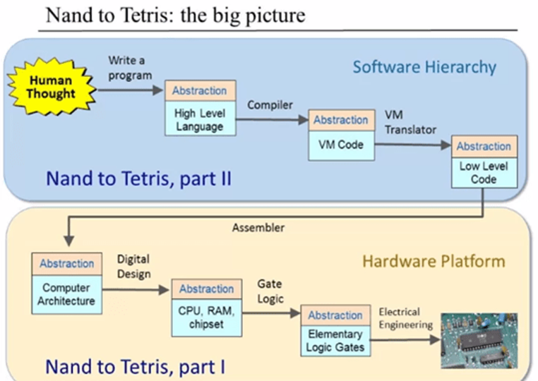
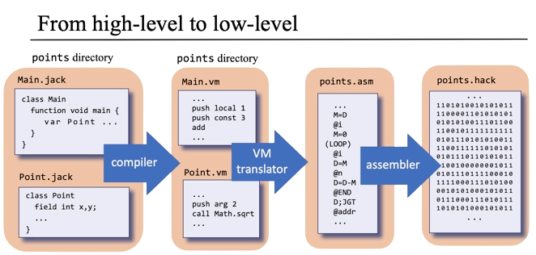

# Nand2Tetris Solutions

Step-by-step solutions to the [Nand2Tetris](https://www.nand2tetris.org/) course. *Build a Modern Computer From First Principles*

  
   
  <em>Nand2Tetris overview: from logic gates → CPU → OS (and from high-level code → machine code).</em>

  
   
  <em>Pipeline: Jack → VM → Assembly → Hack machine code.</em>

---

## 🎮 Demo (Project 9)

  
  <em>Snake game written in Jack (Project 9)</em>

---

## 📚 Course Links

### Part 1
- 🎥 [YouTube playlist](https://www.youtube.com/playlist?list=PLNMIACtpT9BfztU0P92qlw8Gd4vxvvfT1)
- 🎓 [Coursera course](https://www.coursera.org/learn/build-a-computer)

### Part 2 
- 🎥 [YouTube playlist](https://www.youtube.com/playlist?list=PLrDd_kMiAuNmllp9vuPqCuttC1XL9VyVh)
- 🎓 [Coursera course](https://www.coursera.org/learn/nand2tetris2)

---

## 💻 Online Tools

- 🔧 [Web IDE for HDL & VM code](https://nand2tetris.github.io/web-ide/chip/)
- 🌐 [Official Nand2Tetris website](https://www.nand2tetris.org/)

---

## 📦 Contents

This repository contains my implementations for:

- **Project 1:** Logic gates (`.hdl`)
- **Project 2:** ALU design
- **Project 3:** Sequential logic (flip-flops, memory)
- **Project 4:** Machine Language Programs (`.asm`)
- **Project 5:** CPU
- **Project 6:** Assembler
- **Projects 7–8:** Virtual Machine Translator
- **Project 9:** High-Level Programs (`.jack`)
- **Projects 10–11:** Jack Compiler
- **Project 12:** Operating System

---

## ⚠️ Disclaimer

These solutions are for **educational purposes only**. If you're taking the course, try solving the projects on your own; that's where the real learning happens! 💡
